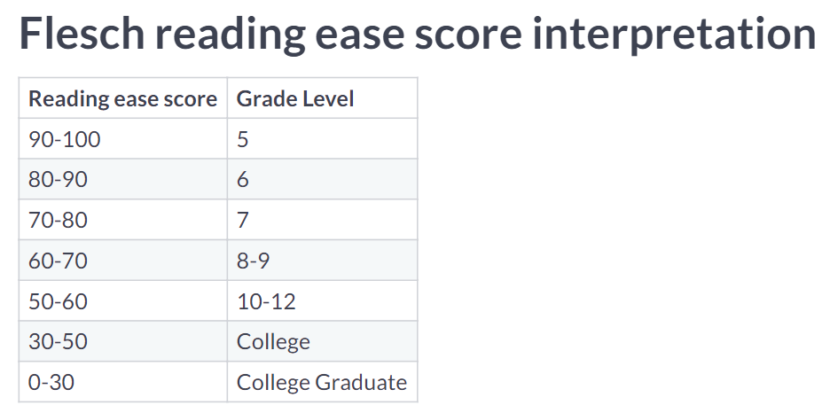
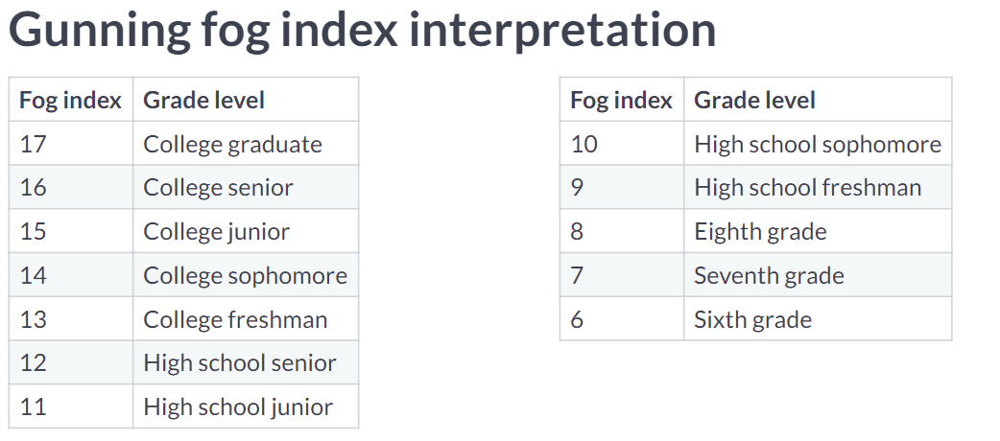
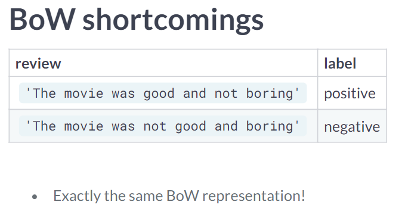
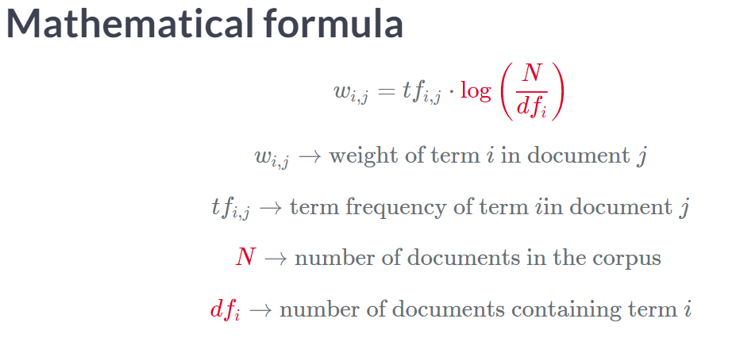
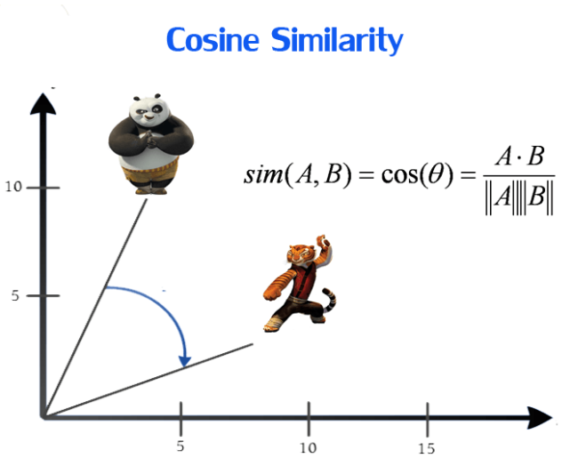

# Feature Engineering for NLP in Python
## Rounak Banik

# Basic Features and Readability Scores
- Going to learn about how to extract features to input into Machine Learning Algorithms.
- They can also work on Categorical Values assuming that they're converted into Numerical form via **One-Hot Enconding**.
- To do this in python, we'll use the pandas function `pd.get_dummies(<df>, columns = ['<name>'])`.
- If you don't include the column, then it will do this to all non-numeric features.
- The first step to the process is to standardize the text.
- This involves potentially converting all words to lower case and reducing words to their base form.
- It may be useful to know things such as the word count, number of characters and the average word length.
- For some applications, you'll want to know what the different Parts of Speech are.
- Another useful piece of information would be the **Named Entity Recognition** to tell the difference between People and Organizations.
- The most basic feature we can extract is the number of characters.
```python
df['numChars'] = df['review'].apply(len)
```
- Another is the number of words - assuming that all words are separated by a space.
- Instructor wants us to create a new function to apply over.
- However, a lambada would be more appropriate here:
```python
df['numWords'] = df['review'].apply( lambda x: len(x.split()))
```
- We can also compute the average word length as well.
- We might also want to include code to extract special parts of text - such as hashtags.
```python
def count_mentions(string):
	# Split the string into words
    words = string.split()

    # Create a list of words that are mentions
    mentions = [word for word in words if word.startswith('@')]

    # Return number of mentions
    return(len(mentions))
```
- Now we're discuss **Readability Tests**.
- At what educational level a person needs to be at to understand the passage?
- This is done with a mathematical formula that takes into account words, syllables and sentence count.
- Some examples of such tests are:
  * The Flesch Reading Ease.
  * Gunning Fog Index.
  * Simple Measure of Gobbledygook
  * Dale-Chall Score
- We'll only touch two of them in this class.
- **Flech Reading Ease** is one of the oldest and most widely used tests.
- Depends on:
  1. Greater the average sentence length; the harder it is to read.
  2. The Greater the number of average syllables; the harder it is to read.
- The higher the score, the greater the readability.

- The **Gunning Fog index** was developed in 1954.
- It also uses the average sentence length.
- It uses the percentage of complex words to tell how hard it is to read.
- *Complex* is defined as words with three or more syllables.
- The higher the score, the less readable it is.

- These tests are found in the package **textatistic**.
-  You will import class Textatistic from it.
- You then pass the text itself and look at the `.score` attribute of the returned object.
```python
# Import Textatistic
from textatistic import Textatistic

# Compute the readability scores
readability_scores = Textatistic(sisyphus_essay).scores

# Print the flesch reading ease score
flesch = readability_scores['flesch_score']
print("The Flesch Reading Ease is %.2f" % (flesch))
```
```python
# Import Textatistic
from textatistic import Textatistic

# List of excerpts
excerpts = [forbes, harvard_law, r_digest, time_kids]

# Loop through excerpts and compute gunning fog index
gunning_fog_scores = []
for excerpt in excerpts:
  readability_scores = Textatistic(excerpt).scores
  gunning_fog = readability_scores['gunningfog_score']
  gunning_fog_scores.append(gunning_fog)

# Print the gunning fog indices
print(gunning_fog_scores)
```

# Text Preprocessing, POS Tagging and NER
- There are a lot of different types of text we'll need to process.
- It is important that we standardize these texts.
- We're be covering a many common corrections to text:
  * Converting words to lowercase.
  * Removing leading and trailing whitespaces.
  * Removing punctuation.
  * Removing stopwords.
  * Expanding Contractions.
  * Removing special Characters - such as nummbers and emojis.
- Tokenization is the process of splitting a string into its constitute tokens.

- We'll be using the spacy library for tokenization.
- We pass the string to the function `nlp()`.
- This will create a spacy Doc object.
- We will generate a list of tokens then by iterating over the doc object.
-
```python
import spacy

# Load the en_core_web_sm model
nlp = spacy.load('en_core_web_sm')

# Create a Doc object
doc = nlp(gettysburg)

# Generate the tokens
tokens = [token.text for token in doc]
print(tokens)
```
- **Lemmatization** is the process of converting a word to its lowercase and base form.
- It also allows us to convert contractions to their real forms.
- We'll be iterating over the doc again, but will be pulling out the .lemma_ of each token.
```python
# Create a Doc object
doc = nlp(gettysburg)

# Generate lemmas
lemmas = [token.lemma_ for token in doc]
```
- With these, we are now ready to start cleaning text.
- in short, we're going to want to remove aspects that are so common that they're not useful for analysis.
- Every string in python has a method called `.isalpha()` is all the characters in it are letters.
- Beware though that tokens that you'd want - such as abbreviations - will get flagged as false with this method.
- Words that are so common that we would want to ignore them are called **Stop Words**.
- Always keep in mind that the text processing you use will be dependent on the application.
```python
# Remove stopwords and non-alphabetic tokens
a_lemmas = [lemma for lemma in lemmas
            if lemma.isalpha() and lemma not in stopwords]
```
- Now we're going to look at Part of Speech Tagging.
- This is popular.
- This is useful to assist with Word-sense Disambiguation.

- Remember that POS tagging is not an exact science.
- The final techique is **Named Entity Recognition**.
- This is the process of identifying and classifying named entities into predefined categories.
- spacy will do this automatically when it processes a document.
- You can access them via the doc.ents part of the processed document.
```python
# Print all named entities and their labels
for ent in doc.ents:
    print(ent.text, ent.label_)
```
- It domain specific termonology, it is best to train your own models.


# N-Gram Models.
- In this section, we're going to be coverting **Vectorization**.
- The **Bag of Words** model extracts word tokens from a word document and counts them.
- The rules of text processing still apply: preprocess where necessary.
- To do this, we'll use the *sklearn* library.
```python
# library to count
from sklearn.feature_extraction.text import CountVerctorizer

# actual object itself that does the counting:
vectorizer = CountVectorizer()

# "build model":
results = vectorizer.fit_transform( corpus )
results.toarray()
```
- You can get the features names from an object using the function `.get_feature_names()`.
```python
# Convert bow_matrix into a DataFrame
bow_df = pd.DataFrame(bow_matrix.toarray())

# Map the column names to vocabulary
bow_df.columns = vectorizer.get_feature_names()
```
- For a Spam Filtering problem, here are the steps:
  1. Text Preprocessing.
  2. Build Bag of Words model.
  3. Machine Learning.
- `CountVectorizer()` can also do text preprocessing.
  * `lowercase` changes letters to lowercase.
  * `strip_accents` substitutes accented characters ('unicode', 'ascii', None)
  * `stop_words` tells it what to use for stopwords ('english', <list>, None)
  * `token_pattern` tells it what regex to accept as the tokenizer.
  * `tokenizer` a function that accepts a string and returns a list of tokens.
- We will not use **Naive Bayes** to build the model.
```python
# import package:
from sklearn.naive_bayes import MultinominalNB

clf = MultinominalNB()
clf.fit( train, y_train )
```
- Here is an example of using `CountVectorizer` with arguements:
```python
# Create a CountVectorizer object
vectorizer = CountVectorizer(lowercase=True, stop_words='english')

# Fit and transform X_train
X_train_bow = vectorizer.fit_transform(X_train)

# Transform X_test
X_test_bow = vectorizer.transform(X_test)
```
- You can calculate the accuracy using the function `.score()`:
```python
# Fit the classifier
clf.fit(X_train_bow , y_train)

# Measure the accuracy
accuracy = clf.score(X_test_bow, y_test)
```
- Just because the same words exist doesn't mean that they're the same sentiment:

- The context of the word is lost.
- The Bag of words is just an N-Gram with n=1.
- Generating bigrams is easy in `CountVectorizer()`
- You can just pass `ngram_range = (2,2)`.
- Adding dimensions can cause a **Curse of Dimensionality**.
- Also, ngrams larger than 3 are quite rare.


# TF-IDF and Similarity Scores
- **Term Frequency - Inverse Document Frequency** is a where the relationship of a word is weighted proportionally based on the number of times it appears in a document.

- It is mostly the same thing as we were doing but we'll be importing `TfidfVectorizer` instead.
```python
# Import TfidfVectorizer
from sklearn.feature_extraction.text import TfidfVectorizer

# Create TfidfVectorizer object
vectorizer = TfidfVectorizer()

# Generate matrix of word vectors
tfidf_matrix = vectorizer.fit_transform(ted)
```
- **Cosine Similarity** is one of the most popular metrics in NLP.
- It measures the how far away two vectors are from one another:

- Due to how it is calculated, it is bound between -1 and 1.
- However, in NLP the values are always between 0 and 1; where 1 is most similar, 0 least similar.
- You can import it from sklearn using `from sklearn.metrics.pairwise import cosine_similarity`.
- It does expect 2D arrays.
- You can use the function `np.dot()` to have numpy calculate the **Dot Product** for you.
```python
# Generate the tf-idf vectors for the corpus
tfidf_matrix = tfidf_vectorizer.fit_transform(corpus)

# Compute and print the cosine similarity matrix
cosine_sim = cosine_similarity(tfidf_matrix,tfidf_matrix)
print(cosine_sim)
```
- Now we're going to build a basic recommendation engine with movies.
- The steps to do this are:
  1. Text Preprocessing.
  2. Generate Tf-Idf.
  3. Geenrate Cosine Similarity Matrix.
- Since the diagonals are always 1, we can ignore them.
- But, to remove the calculation we will need to use `linear_kernel` instead.
- It's imported from the same place but is much faster.
- We're going to touch on an advanced topic with a lot of applications: **Word Embeddings**.
- This is a process of mapping words into an B-Dimensional Vector Space.
- This is out of the scope of the course but we'll touch them.
```python
# Create the doc object
doc = nlp(sent)

# Compute pairwise similarity scores
for token1 in doc:
  for token2 in doc:
    print(token1.text, token2.text, token1.similarity(token2))

# Different exercise
    # Create Doc objects
  mother_doc = nlp(mother)
  hopes_doc = nlp(hopes)
  hey_doc = nlp(hey)

  # Print similarity between mother and hopes
  print(mother_doc.similarity(hopes_doc))

  # Print similarity between mother and hey
  print(mother_doc.similarity(hey_doc))

```


# Research:
- Hans Peter Luhn?

# Reference:
- [Spacy Annotations Documentation](https://spacy.io/api/annotations)
